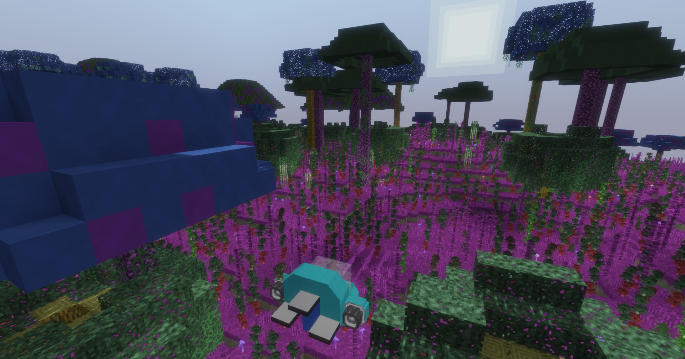

# Nodeverse

This is a procedurally generated space exploration game, inspired by No Man's
Sky and other similar titles, but built around voxel mechanics. It features an
immensely large universe with a never-ending variety of planets to explore.

It is still in very early development, but a simple proof-of-concept game has
been built on top of the code to make it playable. Since this is an
[early](https://semver.org/#spec-item-4) release version, it is expected that
any following versions will make breaking changes to the core game.

## Status
A huge cloud of floating planets is created. Blocks include stone, gravel, dust,
sediment, water, hydrocarbon, lava, grass soil, grass, dry grass, tall grass and
snow. Planets of different colors, rockier, more hilly or flat, richer in
oceans, arid, frozen, volcanic, and with or without living organisms are
generated. World generation features oceans, caves, deserts and craters.

The player can fly using a rocket that they start with. They have a limited
amount of fuel to fly the furthest they can.

## Mods
This is a list of the components that make up this game. Each of these mods can
be used by itself, as long as its dependencies are satisfied.

Name | Dependencies | Description
---- | ------------ | -----------
`nv_planetgen` | None | Generates planet terrain. See its `README.md` for instructions on advanced usage.
`nv_rocket` | `autobox`, `player_api` | Adds a rocket to fly to many other planets, as well as a simple score system.

## TODO
 * Add minerals and ores
 * Add more complex flora
 * Add fauna
 * Add player mechanics
 * Add basic items
 * Add basic crafting
 * Add interplanetary space
 * Add interstellar travel
 * Add spacecraft building
 * Improve all of the above
